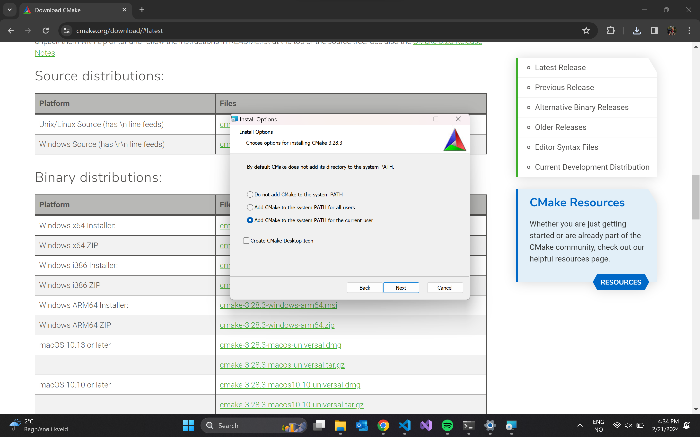

# NotRocketScience - Flight Computer Verification
This repository serves the purpose of hosting examples to test and verify functions of USN Horizon's student reasearched and developed flight computer. 

This repository based of Matej Blagšič's [repository](https://github.com/prtzl/stm32-cmake/tree/master) for cmake with stm32.

## Clone
```shell
git clone --recurse-submodules -j8 git@github.com:USN-Horizon/NRS-Flight-Computer-Verification.git
```
> **_NOTE:_** Recurse submodules makes sure to include the contents of [HAM](https://github.com/USN-Horizon/HAM).

## Dependencies
### Windows
#### Required
- Git `winget install git.git`
- [STM32 CubeCLT](https://www.st.com/en/development-tools/stm32cubeclt.html)
    - etter STM32 CubeCLT er installert:
    - https://helpdeskgeek.com/windows-10/add-windows-path-environment-variable/
- [cmake](https://cmake.org/download/) 
    - under Binary distributions: velg "Windows x64 installer" og velg "Add CMake to the system PATH for the current user".   

- pyocd `pip install pyocd`
    - om pip ikke er installert: `python -m ensurepip`
#### Optional
- [MINGW](https://sourceforge.net/projects/mingw/files/latest/download)
    - MINGW skal ikke være nødvendig om Qt er lastet ned.
- [STM32 CubeMX](https://www.st.com/en/development-tools/stm32cubemx.html)


# Guide

Building binary
```shell
make build
```
Flashing device
```shell
make flash
```
Removing build files
```shell
make clean
```
Generate documentation
```shell
make doc
```
Formatting
TODO

# Useful resources
- [STM32 CubeProgrammer](https://www.st.com/resource/en/user_manual/um2237-stm32cubeprogrammer-software-description-stmicroelectronics.pdf)

